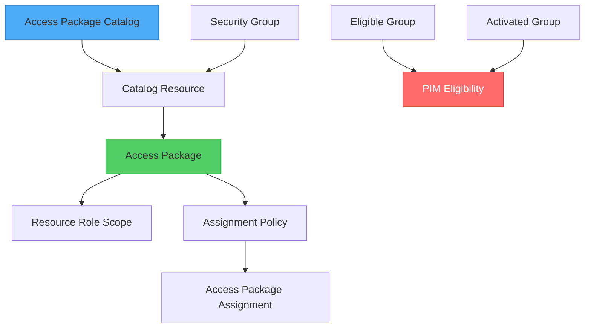

# Azure Entitlement Management Bicep Local Extension (Experimental)

A custom Bicep Local Extension for managing **Azure Entitlement Management** and **Privileged Identity Management (PIM)** resources via Infrastructure-as-Code.

> [!NOTE]
> This is an experimental Bicep feature and is subject to change. Do not use it in production.

## 👨‍💻 About This Project

**Built by an Azure Platform Engineer who thinks outside the box (sometimes too far outside).**

I'm not a C#/.NET expert—I'm a platform engineer who loves experimenting with Azure's boundaries. This entire repository was generated **almost completely with GitHub Copilot Agent Mode (Claude Sonnet 4.5)** using some seriously kick-ass prompting and custom chatmode instructions (check out `.github/chatmodes/` for the secret sauce that injected steroids into the agent 💪).

**But no kidding—Copilot Agent Mode is THE way forward.** All files have been tested and work like a charm. This is proof that with the right instructions and a willingness to experiment, you can build production-quality extensions without being a language expert.

If you're curious how this magic happened, dive into the chatmode files. They're the real MVPs here! 🚀

### Why I Built This

I've implemented Azure Entitlement Management deployments **numerous times** using different approaches:

1. **Pure JSON + PowerShell**: Describing catalogs and access packages in JSON files, then deploying via PowerShell scripts calling Graph API
2. **Bicep Framework + PowerShell Hybrid**: Using Bicep to describe and deploy groups and entitlement catalogs, outputting desired state, then consuming it in PowerShell tasks for deployment

**Both approaches had the same problem**: **No true Infrastructure-as-Code!**

You couldn't:
- ✅ See the desired state in a single declarative file
- ✅ Run `bicep local-deploy` and have everything created idempotently
- ✅ Track entitlement management state alongside Azure resources
- ✅ Use native Bicep syntax with IntelliSense for entitlement resources

**This extension solves that.** Now entitlement management is **first-class IaC**, just like ARM templates, but with the simplicity of Bicep and the power of local-deploy.

## 🎯 Current Capabilities

- ✅ **Access Package Catalogs** - Organize and manage access packages
- ✅ **Access Packages** - Define collections of resources and roles
- ✅ **Access Package Assignment Policies** - Control who can request access with approval workflows
- ✅ **Access Package Assignments** - Direct user assignments (permanent or scheduled)
- ✅ **Access Package Catalog Resources** - Add groups/apps to catalogs
- ✅ **Access Package Resource Role Scopes** - Assign specific roles to access packages
- ✅ **Security Groups** ⚠️ - Create and manage Entra ID security groups (testing/demo only)
- ✅ **Group PIM Eligibility** ⭐ - **UNIQUE!** Configure JIT activation between eligible and activated groups

See the [Sample](./Sample/) folder for deployment examples.

## ⭐ Why This Extension?

### Unique Value: PIM Eligibility

**Microsoft Graph Bicep extension does NOT have `groupPimEligibility` resource!**

This extension is currently the **ONLY infrastructure-as-code solution** for managing PIM eligibility assignments between security groups.

```bicep
// ✅ Only possible with this extension!
resource pimEligibility 'groupPimEligibility' = {
  eligibleGroupUniqueName: 'eligible-developers'
  activatedGroupUniqueName: 'activated-developers'
  maxActivationDuration: 'PT2H'  // 2 hours max JIT activation
  policyTemplateJson: loadTextContent('./pim-policy.json')
}
```

### Security Group Resource (⚠️ For Testing Only)

**Microsoft Graph Bicep** (`az/microsoft-graph@1.0`) already provides `microsoft.graph/groups` resource!

**This extension's `securityGroup` and `groupPimEligibility` resources deploy groups with the `uniqueName` property** (just like Bicep Graph groups). This means:

✅ **Groups are reusable outside Bicep local-deploy!**
- Groups created with `uniqueName: 'my-unique-group'` can be referenced from standard Bicep files
- Other deployments can query these groups via `uniqueName`
- No need to duplicate group definitions across deployment types

**This extension's `securityGroup` resource is for**:
- ✅ All-in-one testing (groups + entitlement management in one deployment)
- ✅ Sample/demo scenarios
- ✅ Learning the full workflow
- ✅ Creating groups that will be used in both local-deploy and standard Bicep

**For production**:
- Use [Microsoft Graph Bicep](https://github.com/microsoftgraph/msgraph-bicep-types) for security groups
- Use this extension for entitlement management + PIM eligibility only

## 🚀 Quick Start

### Prerequisites

- **.NET 9 SDK**
- **Bicep CLI** v0.38.33+ (with experimental features)
- **PowerShell** 7.x
- **Microsoft Graph API tokens** with permissions:
  - `EntitlementManagement.ReadWrite.All`
  - `Group.ReadWrite.All` (for security groups/PIM)
  - `User.Read.All` (for security groups/PIM)

### 1. Enable Experimental Features

Add to `bicepconfig.json`:

```json
{
  "experimentalFeaturesEnabled": {
    "localDeploy": true
  }
}
```

### 2. Publish the Extension Locally

```powershell
# From the entitlement-management folder
pwsh Scripts/Publish-Extension.ps1 -Target "./Sample/entitlementmgmt-ext"
```

This compiles the extension for all platforms (macOS, Linux, Windows) and patches generated types.

### 3. Get API Tokens

```bash
# Example: Using a token script
python3 /path/to/get_token.py

# Sets environment variables:
# - ENTITLEMENT_TOKEN
# - GROUP_USER_TOKEN
```

#### Why Two Tokens?

**Least privilege principle in action!**

In many organizations, users don't have blanket permissions across all Graph API scopes. You might have:
- ✅ `EntitlementManagement.ReadWrite.All` but NOT `Group.ReadWrite.All`
- ✅ `Group.ReadWrite.All` but NOT `PrivilegedAccess.ReadWrite.AzureADGroup`

**This extension splits token requirements** so you can use different credentials based on what you're deploying:

```bicep
extension entitlementmgmt with {
  entitlementToken: entitlementToken  // For catalogs, packages, policies, assignments
  groupUserToken: groupUserToken      // For security groups, PIM, user operations
}
```

**If you have all permissions in one token**: Just use the same token for both parameters!

```bicep
extension entitlementmgmt with {
  entitlementToken: myFullAccessToken
  groupUserToken: myFullAccessToken  // Same token = no problem!
}
```

**Future roadmap**: I'm considering adding a third token (`pimScheduledRequestToken`) for PIM eligibility schedule requests to further separate privileges. Not implemented yet, but the architecture supports it! 🚀

### 4. Deploy a Sample

```bash
cd Sample/01-catalog-basic
bicep local-deploy main.bicepparam
```

See [Sample Documentation](./Sample/README.md) for all deployment examples.

## 🧪 Testing Automation with AI

**Want to validate ALL samples automatically with idempotency checks?**

This repository includes **two ways** to run comprehensive AI-assisted testing:

### Option 1: Custom Chatmode (Recommended) 🎯

**Best for**: Interactive testing sessions with GitHub Copilot

```bash
# Step 1: Switch to "Testing Automation Agent" chatmode
# (Available in GitHub Copilot's chatmode selector)

# Step 2: Simply ask:
"Test all samples"

# Step 3: Review the generated report
cat TESTING_RESULTS.md
```

**Chatmode location**: `.github/chatmodes/testing-agent.chatmode.md`

**Benefits**:
- ✅ Pre-configured testing personality and protocols
- ✅ Automatic reference to instructions file
- ✅ Knows expected baselines and red flags
- ✅ Professional output formatting
- ✅ Interactive guidance (ask questions, get clarifications)

### Option 2: Standalone Prompt (Universal) 📋

**Best for**: Any AI assistant (Claude, ChatGPT, etc.)

```bash
# Step 1: Copy the testing prompt
# Located in: .github/instructions/testing-automation.instructions.md

# Step 2: Paste into your AI assistant and ask:
"Test all samples in this repository using this protocol"

# Step 3: Review the generated report
cat TESTING_RESULTS.md
```

**Prompt location**: `.github/instructions/testing-automation.instructions.md`

**Benefits**:
- ✅ Works with ANY AI assistant (not just Copilot)
- ✅ Copy-paste ready (no setup required)
- ✅ Complete protocol in one file
- ✅ Portable across different AI platforms

### What Both Methods Test

| Sample | Resources | Validations |
|--------|-----------|-------------|
| 01-catalog-basic | 3 | Catalog + Package + Policy |
| 02-catalog-with-groups | 6 | Groups → Catalog → Package → Role → Policy |
| 03-catalog-pim-jit-access | 8 | Full PIM workflow (eligible → activated) |
| 04-catalog-approval-workflows | 9 | 4 approval patterns |

**Testing features** (both methods):
- ✅ **Build all samples** (validate compilation)
- ✅ **Deploy each sample 3 times** (idempotency validation)
- ✅ **Compare resource IDs** across deployments (detect non-idempotent resources)
- ✅ **Generate testing reports** (TESTING_RESULTS.md with evidence)
- ✅ **Automate token acquisition** (no manual copy-paste)
- ✅ **Performance profiling** (track deployment times)

### What Gets Tested

| Sample | Resources | Validations |
|--------|-----------|-------------|
| 01-catalog-basic | 3 | Catalog + Package + Policy |
| 02-catalog-with-groups | 6 | Groups → Catalog → Package → Role → Policy |
| 03-catalog-pim-jit-access | 8 | Full PIM workflow (eligible → activated) |
| 04-catalog-approval-workflows | 9 | 4 approval patterns (manager, user, group, multi-stage) |

**Each sample is deployed 3 times** to validate:
- ✅ First deploy: Creates all resources
- ✅ Second deploy: Reuses existing resources (IDs unchanged)
- ✅ Third deploy: Confirms consistent behavior

### Why This Matters

**Idempotency is CRITICAL for IaC!** If resource IDs change on re-deployment, your handler is **creating duplicates** instead of updating existing resources. This testing protocol catches those bugs automatically.

**Example: Policy Idempotency Bug (Now Fixed)**

Before the fix, running `bicep local-deploy` three times produced:
- Deploy #1: `policyId: 1f9bbc02-6a69-49a7-a292-74245b9b8b06`
- Deploy #2: `policyId: b04d8cab-7171-4d65-a9ec-19c6515590da` ❌ DIFFERENT ID!
- Deploy #3: `policyId: 48c8fa6a-cf82-4cba-821e-ecf68aafc066` ❌ DIFFERENT ID!

**The AI testing agent detected this automatically** and flagged it in TESTING_RESULTS.md as:

```markdown
### Issue #1: Policy Idempotency - NOT IDEMPOTENT ❌

**Evidence**:
- Deploy #1 ID: 1f9bbc02-6a69-49a7-a292-74245b9b8b06
- Deploy #2 ID: b04d8cab-7171-4d65-a9ec-19c6515590da
- Deploy #3 ID: 48c8fa6a-cf82-4cba-821e-ecf68aafc066

**Root Cause**: Graph API query missing $expand=accessPackage parameter

**Recommendation**: Fix handler to query existing policies correctly
```

After the fix, all 3 deployments return the same ID! ✅

### Testing Protocol Files

**Chatmode**: `.github/chatmodes/testing-agent.chatmode.md`
- Interactive testing agent personality
- Pre-configured protocols and baselines
- Automatic instructions reference
- Best for GitHub Copilot users

**Instructions**: `.github/instructions/testing-automation.instructions.md`
- Complete step-by-step testing protocol
- Token acquisition automation
- Expected baseline results (timing benchmarks)
- Error handling strategies and debugging commands
- TESTING_RESULTS.md template
- Quality checklist and success criteria
- Best for any AI assistant (universal)

**Example Results**: `TESTING_RESULTS.md`
- See how the testing protocol caught the policy idempotency bug
- Professional report format (executive summary → detailed results → issues → conclusion)

### Manual Testing (Without AI)

If you prefer manual testing:

```bash
# Deploy a sample 3 times
cd Sample/01-catalog-basic

# Deploy #1
bicep local-deploy main.bicepparam | tee deploy1.log

# Deploy #2
sleep 10
bicep local-deploy main.bicepparam | tee deploy2.log

# Deploy #3
sleep 10
bicep local-deploy main.bicepparam | tee deploy3.log

# Compare output IDs
grep "catalogId" deploy*.log
# All 3 should show the SAME ID!
```

**Pro tip**: Use the AI prompt even for manual testing—it includes all the commands, expected results, and comparison logic! 🚀

---

## 📖 Bicep Usage Example

### Basic Catalog + Access Package

```bicep
targetScope = 'local'

extension entitlementmgmt with {
  entitlementToken: parEntitlementToken
}

@secure()
param parEntitlementToken string

resource catalog 'accessPackageCatalog' = {
  displayName: 'Engineering Resources'
  description: 'Access packages for engineering team'
  isExternallyVisible: false
  catalogType: 'userManaged'
  state: 'published'
}

resource accessPackage 'accessPackage' = {
  displayName: 'Developer Access'
  catalogId: catalog.id
  description: 'Standard developer access'
  isHidden: false
}

resource policy 'accessPackageAssignmentPolicy' = {
  displayName: 'All Users - Manager Approval'
  accessPackageId: accessPackage.id
  allowedTargetScope: 'AllMemberUsers'

  requestApprovalSettings: {
    isApprovalRequired: true
    approvalMode: 'SingleStage'
    approvalStages: [
      {
        approvalStageTimeOutInDays: 14
        primaryApprovers: [
          {
            oDataType: '#microsoft.graph.requestorManager'
            managerLevel: 1
          }
        ]
      }
    ]
  }

  durationInDays: 90
  canExtend: true
}
```

### PIM Eligibility (⭐ Unique Feature!)

```bicep
// Create eligible group (who CAN request activation)
resource eligibleGroup 'securityGroup' = {
  uniqueName: 'pim-eligible-developers'
  displayName: 'PIM Eligible Developers'
  members: ['<user-guid>']
}

// Create activated group (temporary membership via PIM)
resource activatedGroup 'securityGroup' = {
  uniqueName: 'pim-activated-developers'
  displayName: 'PIM Activated Developers'
  members: []  // PIM controls membership
}

// Configure PIM eligibility
resource pimEligibility 'groupPimEligibility' = {
  // Option 1: Reference by ID (supports cross-deployment scenarios) (original approach)
  eligibleGroupId: eligibleGroup.id
  activatedGroupId: activatedGroup.id

  // Option 2: Reference by uniqueName
  // eligibleGroupUniqueName: eligibleGroup.uniqueName
  // activatedGroupUniqueName: activatedGroup.uniqueName

  accessId: 'member'
  maxActivationDuration: 'PT2H'  // 2 hours
  expirationDateTime: '2026-12-31T23:59:59Z'
  policyTemplateJson: loadTextContent('./pim-policy.json')
}
```

## 📚 Documentation

| Resource | Description | Documentation |
|----------|-------------|---------------|
| `accessPackageCatalog` | Container for access packages | [View Docs](./docs/accessPackageCatalog.md) |
| `accessPackage` | Defines collections of resources | [View Docs](./docs/accessPackage.md) |
| `accessPackageAssignmentPolicy` | Approval and lifecycle rules | [View Docs](./docs/accessPackageAssignmentPolicy.md) |
| `accessPackageAssignment` | Direct user assignments | [View Docs](./docs/accessPackageAssignment.md) |
| `accessPackageCatalogResource` | Add resources to catalogs | [View Docs](./docs/accessPackageCatalogResource.md) |
| `accessPackageResourceRoleScope` | Assign roles to packages | [View Docs](./docs/accessPackageResourceRoleScope.md) |
| `securityGroup` ⚠️ | Entra ID groups (testing only) | [View Docs](./docs/securityGroup.md) |
| `groupPimEligibility` ⭐ | PIM JIT activation (unique!) | [View Docs](./docs/groupPimEligibility.md) |

## 🏗️ Architecture

### Resource Dependency Flow



### Microsoft Graph API Integration

All resources use **Microsoft Graph API** with proper authentication:

- **Entitlement Management**: `/identityGovernance/entitlementManagement/*`
- **Security Groups**: `/groups/*`
- **PIM Eligibility**: `/identityGovernance/privilegedAccess/group/eligibilityScheduleRequests`

Handlers implement:
- ✅ Idempotent operations (query before create/update)
- ✅ Retry logic with exponential backoff (Entra ID replication delays)
- ✅ Proper error handling and diagnostics
- ✅ Resource dependency management

## 🔧 Development

### Build & Publish

```powershell
# Build for all platforms (macOS, Linux, Windows)
pwsh Scripts/Publish-Extension.ps1 -Target "./Sample/entitlementmgmt-ext"

# Build succeeded in ~20s
# Extension published successfully to ./Sample/entitlementmgmt-ext
```

### Project Structure

```
entitlement-management/
├── src/
│   ├── AccessPackageCatalog/          # Catalog handler
│   ├── AccessPackage/                  # Access package handler
│   ├── AccessPackageAssignmentPolicy/  # Policy handler (uses beta API)
│   ├── AccessPackageAssignment/        # Assignment handler
│   ├── AccessPackageCatalogResource/   # Catalog resource handler
│   ├── AccessPackageResourceRoleScope/ # Role scope handler
│   ├── SecurityGroup/                  # Security group handler
│   ├── GroupPimEligibility/            # PIM eligibility handler ⭐
│   └── Configuration.cs                # Shared token config
├── Sample/
│   ├── 01-catalog-basic/               # Minimal deployment
│   ├── 02-catalog-with-groups/         # Group membership workflow
│   ├── 03-catalog-pim-jit-access/      # PIM eligibility (unique!) ⭐
│   └── 04-catalog-approval-workflows/  # Approval patterns
├── docs/                               # Resource documentation
├── Scripts/
│   └── Publish-Extension.ps1           # Multi-platform build script
└── README.md                           # This file
```

### Handler Pattern

Each resource handler implements:

```csharp
public class MyResourceHandler : TypedResourceHandler<MyResource, MyResourceIdentifiers>
{
    // Preview: Display what will be created (no-op)
    protected override Task<MyResourceIdentifiers> Preview(...)

    // CreateOrUpdate: Idempotent save operation
    protected override Task<MyResourceIdentifiers> CreateOrUpdate(...)

    // Delete: Remove resource (if implemented)
    protected override Task Delete(...)
}
```

All handlers use:
- Graph API authentication via bearer tokens
- Retry logic for Entra ID replication delays
- Error handling with user-friendly messages

## 🐛 Known Issues & Limitations

### Requestor Array IntelliSense

**Issue**: Bicep type generator emits only one of `allowedRequestors` or `onBehalfRequestors` in IntelliSense.

**Workaround**: `Scripts/Publish-Extension.ps1` automatically patches the generated types to expose both arrays.

**Status**: Workaround implemented and automated.

### Entra ID Replication Delays

**Issue**: Resources created via one API (e.g., Groups) may not be immediately visible to another API (Entitlement Management).

**Solution**: Handlers implement retry logic with exponential backoff (2s → 4s → 8s → 16s).

**Impact**: Deployments with cross-API dependencies take longer (~20-40s for catalog resources).

### Delete Operations

**Status**: Not implemented yet. Remove resources via Azure Portal:
- **Entra ID** → **Identity Governance** → **Entitlement Management**

## 🤝 Contributing

This is an experimental extension developed for learning and demonstration purposes.

Contributions welcome:
- Bug fixes
- New resource types
- Documentation improvements
- Sample templates

### Sample Folder Naming Convention

All sample folders under `Sample/` **must** follow this naming pattern:

```
<two-digits>-catalog-<descriptive-name>
```

**Examples**:
- ✅ `01-catalog-basic` - Minimal deployment
- ✅ `02-catalog-with-groups` - Catalog with security groups
- ✅ `03-catalog-pim-jit-access` - Catalog with PIM eligibility
- ✅ `04-catalog-approval-workflows` - Catalog with approval patterns

**Why this convention?**:
- **Consistent sorting**: Two-digit prefix ensures proper ordering (01, 02, ..., 10, 11)
- **Clear scope**: `catalog` prefix immediately identifies entitlement management samples
- **Descriptive**: Remaining name describes the specific scenario

**When adding new samples**:
1. Use next available two-digit number (05, 06, etc.)
2. Always include `-catalog-` after the number
3. Use descriptive kebab-case name (lowercase, hyphens)
4. Update all README.md files referencing sample folders

## 📄 License

See LICENSE file in repository root.

## 🙏 Acknowledgments

- **Bicep Team** for the experimental local-deploy feature
- **Microsoft Graph API** for entitlement management endpoints
- **Azure DevOps Bicep Extension** for the handler pattern inspiration

## 📞 Support

This is an experimental project. For production scenarios, use:
- **Azure CLI**: `az ad` commands
- **Microsoft Graph PowerShell**: Entitlement management cmdlets
- **Azure Portal**: Manual configuration

---

**Built with ❤️ for the Azure community**
