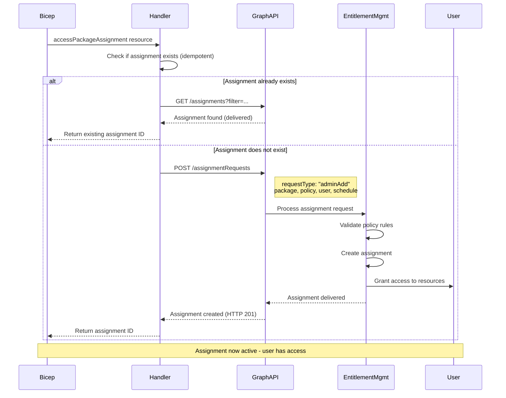

# accessPackageAssignment

Assign users to access packages with optional time-bound scheduling for temporary access.

## Example usage

### Creating a permanent assignment

This example shows how to assign a user permanent access to an access package.

```bicep
resource engineeringCatalog 'accessPackageCatalog' = {
  displayName: 'Engineering Resources'
}

resource devAccessPackage 'accessPackage' = {
  displayName: 'Developer Access'
  catalogId: engineeringCatalog.id
}

resource directPolicy 'accessPackageAssignmentPolicy' = {
  displayName: 'Direct Assignment'
  accessPackageId: devAccessPackage.id
  allowedTargetScope: 'NotSpecified'  // Admin-only
  expiration: {
    type: 'noExpiration'  // No expiration
  }
}

// Assign full-time employee (permanent access)
resource userAssignment 'accessPackageAssignment' = {
  accessPackageId: devAccessPackage.id
  assignmentPolicyId: directPolicy.id
  targetUserId: '7a72c098-a42d-489f-a3fa-c2445dec6f9c'  // User Object ID
  justification: 'Full-time developer on platform team'
}

output assignmentId string = userAssignment.id
```

### Creating a scheduled (time-bound) assignment ⏰

This example shows how to assign temporary access with start and end dates.

```bicep
// Assign contractor (temporary access: Q1 2025)
resource contractorAssignment 'accessPackageAssignment' = {
  accessPackageId: devAccessPackage.id
  assignmentPolicyId: directPolicy.id
  targetUserId: '550e8400-e29b-41d4-a716-446655440000'
  justification: 'Contractor for Q1 2025 migration project'

  schedule: {
    startDateTime: '2025-01-01T00:00:00Z'  // Access starts Jan 1, 2025
    expiration: {
      type: 'afterDateTime'
      endDateTime: '2025-03-31T23:59:59Z'  // Access ends March 31, 2025
    }
  }
}

output contractorAssignmentStart string = contractorAssignment.schedule.startDateTime
output contractorAssignmentEnd string = contractorAssignment.schedule.expiration.endDateTime
```

### Creating multiple assignments from a list

This example shows how to assign multiple users using an array loop.

```bicep
param developerUserIds array = [
  '7a72c098-a42d-489f-a3fa-c2445dec6f9c'
  '550e8400-e29b-41d4-a716-446655440000'
  'a1b2c3d4-e5f6-4a5b-8c7d-9e0f1a2b3c4d'
]

// Assign all developers
resource developerAssignments 'accessPackageAssignment' = [for userId in developerUserIds: {
  accessPackageId: devAccessPackage.id
  assignmentPolicyId: directPolicy.id
  targetUserId: userId
  justification: 'Developer team member'
}]
```

### Creating scheduled assignments with different durations

This example shows how to grant access for different time periods (common for contractors).

```bicep
// Short-term contractor (1 month)
resource shortTermContractor 'accessPackageAssignment' = {
  accessPackageId: devAccessPackage.id
  assignmentPolicyId: directPolicy.id
  targetUserId: 'contractor1-user-id'
  justification: 'Short-term security audit - 1 month'
  schedule: {
    startDateTime: '2025-01-15T00:00:00Z'
    expiration: {
      type: 'afterDateTime'
      endDateTime: '2025-02-15T23:59:59Z'  // 1 month later
    }
  }
}

// Long-term contractor (6 months)
resource longTermContractor 'accessPackageAssignment' = {
  accessPackageId: devAccessPackage.id
  assignmentPolicyId: directPolicy.id
  targetUserId: 'contractor2-user-id'
  justification: 'Long-term migration project - 6 months'
  schedule: {
    startDateTime: '2025-01-01T00:00:00Z'
    expiration: {
      type: 'afterDateTime'
      endDateTime: '2025-06-30T23:59:59Z'  // 6 months later
    }
  }
}

// Intern (3 months, summer internship)
resource internAssignment 'accessPackageAssignment' = {
  accessPackageId: devAccessPackage.id
  assignmentPolicyId: directPolicy.id
  targetUserId: 'intern-user-id'
  justification: 'Summer 2025 intern'
  schedule: {
    startDateTime: '2025-06-01T00:00:00Z'
    expiration: {
      type: 'afterDateTime'
      endDateTime: '2025-08-31T23:59:59Z'  // 3 months
    }
  }
}
```

## Argument reference

The following arguments are available:

- `accessPackageId` - **(Required, Immutable)** The ID of the access package to assign. Get this from `accessPackage.id`.

- `assignmentPolicyId` - **(Required, Immutable)** The ID of the assignment policy governing this assignment. Get this from `accessPackageAssignmentPolicy.id`.

- `targetUserId` - **(Required, Immutable)** The Object ID (GUID) of the user being assigned. Find user ID with: `az ad user show --id user@domain.com --query id -o tsv`

- `justification` - **(Optional, Immutable)** Business justification for the assignment. Recommended for audit purposes.

- `schedule` - **(Optional, Immutable)** Time-bound access schedule. **Perfect for contractors, interns, temporary projects**. Contains:
  - `startDateTime` - **(Required)** When access should become active (ISO 8601 format with 'Z' timezone)
  - `expiration` - **(Required)** When access should end:
    - `type`: `'noExpiration'` | `'afterDateTime'` | `'afterDuration'`
    - `endDateTime`: End date/time (required if `type` is `'afterDateTime'`)
    - `duration`: ISO 8601 duration (required if `type` is `'afterDuration'`)

## Attribute reference

In addition to all arguments above, the following attributes are outputted:

- `id` - **[OUTPUT]** The unique identifier (GUID) of the assignment
- `accessPackageId` - **[OUTPUT]** The access package ID (same as input)
- `assignmentPolicyId` - **[OUTPUT]** The policy ID (same as input)
- `targetUserId` - **[OUTPUT]** The user ID (same as input)
- `schedule` - **[OUTPUT]** The schedule object (if provided)
  - `startDateTime` - Start date/time
  - `expiration.endDateTime` - End date/time (if applicable)
  - `expiration.type` - Expiration type

## Notes

### 🔄 Assignment Flow (How It Works)

Assignments are NOT created directly! Instead, the handler:

1. Creates an **Assignment Request** via Microsoft Graph API
2. Graph API processes the request (usually within seconds)
3. Returns the **Assignment** resource (delivered state)

This is why you see `accessPackageAssignmentRequest` in Graph API docs but use `accessPackageAssignment` in Bicep!

**Flow Diagram**:



**Behind the scenes (code)**:

```csharp
// Handler creates an assignment request with requestType="adminAdd"
POST /identityGovernance/entitlementManagement/assignmentRequests
{
  "requestType": "adminAdd",
  "accessPackage": { "id": "<package-id>" },
  "assignmentPolicy": { "id": "<policy-id>" },
  "target": { "objectId": "<user-id>" },
  "schedule": { ... }  // Optional
}

// Graph API processes → Creates assignment → Returns delivered assignment
```

### ⏰ Scheduled Assignments - Perfect for Temporary Access!

**Use Cases**:

- 🎯 **Contractors**: Grant access for project duration only
- 🎯 **Interns**: Automatic access for summer/winter internship period
- 🎯 **Temporary Projects**: Time-limited access for specific initiatives
- 🎯 **Vendor Access**: Scheduled access for vendor engagements
- 🎯 **Compliance**: Enforce time-based access controls

**Schedule Expiration Types**:

```bicep
// Option 1: No expiration (permanent until manually removed)
expiration: {
  type: 'noExpiration'
}

// Option 2: Expire on specific date/time
expiration: {
  type: 'afterDateTime'
  endDateTime: '2025-12-31T23:59:59Z'
}

// Option 3: Expire after duration (e.g., 90 days from start)
expiration: {
  type: 'afterDuration'
  duration: 'P90D'  // ISO 8601 duration: P90D = 90 days
}
```

**Important**: All timestamps must be in **UTC (ISO 8601 with 'Z')** format!

### 🔒 Security and Permissions

This resource requires the **`entitlementToken`** with:

- **EntitlementManagement.ReadWrite.All**: Required to create/manage assignments

```bicep
extension entitlementmgmt with {
  entitlementToken: parEntitlementToken  // ✅ For assignments!
}
```

### 🎯 Best Practices

1. **Always Include Justification**: Required for audit compliance
   ```bicep
   resource assignment 'accessPackageAssignment' = {
     justification: 'Developer on platform migration project - approved by Jane Smith on 2025-01-15'
   }
   ```

2. **Use Scheduled Access for Contractors**: Automatic cleanup when contract ends
   ```bicep
   schedule: {
     startDateTime: '${contractStartDate}T00:00:00Z'
     expiration: {
       type: 'afterDateTime'
       endDateTime: '${contractEndDate}T23:59:59Z'
     }
   }
   ```

3. **Get User IDs Programmatically**: Avoid hardcoding user IDs
   ```bash
   # Get user ID from email
   USER_ID=$(az ad user show --id user@domain.com --query id -o tsv)
   echo "export DEVELOPER_USER_ID='$USER_ID'"
   ```

4. **Review Policy Expiration Settings**: Policy expiration can override schedule
   ```bicep
   // If policy has max duration of 30 days, schedule can't exceed that
   resource policy 'accessPackageAssignmentPolicy' = {
     expiration: {
       type: 'afterDuration'
       duration: 'P30D'  // Max 30 days
     }
   }
   ```

## Troubleshooting

### Error: "User not found" or "Invalid target user ID"

**Cause**: The `targetUserId` doesn't exist or is incorrect.

**Solution**: Get the correct user Object ID:

```bash
# Get user ID by UPN (email)
az ad user show --id user@domain.com --query id -o tsv

# Get user ID by display name (less reliable)
az ad user list --filter "displayName eq 'John Doe'" --query [0].id -o tsv
```

### Error: "403 Forbidden" when creating assignment

**Cause**: Missing permissions or policy doesn't allow admin assignments.

**Solution**:

1. Verify `entitlementToken` has `EntitlementManagement.ReadWrite.All`
2. Check policy `allowedTargetScope` allows admin assignments:
   ```bicep
   resource policy 'accessPackageAssignmentPolicy' = {
     allowedTargetScope: 'NotSpecified'  // ✅ Allows admin assignments!
     // NOT: 'SpecificDirectorySubjects' (requires self-service)
   }
   ```

### Schedule ignored - assignment created without time bounds

**Cause**: Schedule format is incorrect or policy overrides it.

**Solution**: Verify schedule format:

```bicep
// ✅ Correct format
schedule: {
  startDateTime: '2025-01-01T00:00:00Z'  // MUST include 'Z' for UTC!
  expiration: {
    type: 'afterDateTime'  // Type must be exact string
    endDateTime: '2025-03-31T23:59:59Z'
  }
}

// ❌ Wrong format
schedule: {
  startDateTime: '2025-01-01'  // Missing time and 'Z'
  expiration: {
    type: 'date'  // Wrong type!
    endDateTime: '2025-03-31'
  }
}
```

### Assignment created but user doesn't get access

**Cause**: The access package is empty (no resource roles added).

**Solution**: Add resources to the access package:

```bicep
// 1. Add group to catalog
resource catalogResource 'accessPackageCatalogResource' = {
  catalogId: catalog.id
  originId: '<group-id>'
  originSystem: 'AadGroup'
}

// 2. Add group role to access package
resource resourceRole 'accessPackageResourceRoleScope' = {
  accessPackageId: package.id
  resourceOriginId: '<group-id>'
  roleOriginId: 'Member_<group-id>'
  catalogResourceId: catalogResource.id
}

// 3. Then assignment will grant actual access!
```

### How to remove an assignment?

**Note**: Assignment deletion is not yet implemented. To remove access:

1. **Option 1**: Set expiration date in the past (manual in Azure Portal)
2. **Option 2**: Remove user from the group manually
3. **Option 3**: Delete the access package (removes all assignments)

## Additional reference

For more information, see the following links:

- [Microsoft Graph Assignment API][00]
- [Assignment Request API][01]
- [Schedule Access Tutorial][02]
- [Entitlement Management Overview][03]

<!-- Link reference definitions -->
[00]: https://learn.microsoft.com/en-us/graph/api/resources/accesspackageassignment?view=graph-rest-1.0
[01]: https://learn.microsoft.com/en-us/graph/api/resources/accesspackageassignmentrequest?view=graph-rest-1.0
[02]: https://learn.microsoft.com/en-us/graph/tutorial-access-package-api
[03]: https://learn.microsoft.com/en-us/azure/active-directory/governance/entitlement-management-overview
